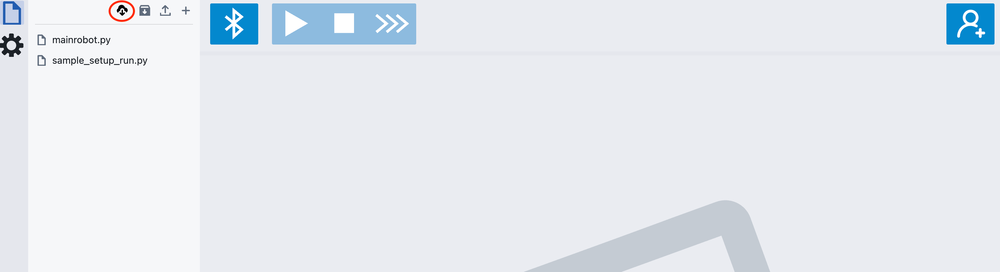

# Pybricks-Ext Chrome Extension

This is a Chrome extension that adds a "Save all files" button to the Pybricks Code interface. This allows you to save all your open files as plain Python source code to a local directory on your computer, which is a convenient alternative to archiving them into a zip file.

## Features

- Adds a "Save all files" button to the Pybricks Code UI.
- Saves all open files to a user-selected directory.
- Files are saved as plain `.py` source files.

## Installation and Usage

### 1. Install Node.js and npm

You need to have Node.js and its package manager, npm, installed on your system. npm is included with Node.js.

#### Windows

1.  Go to the official Node.js website: https://nodejs.org/
2.  Download the LTS (Long Term Support) version installer for Windows.
3.  Run the installer (`.msi` file) and follow the on-screen instructions. The installer will add Node.js and npm to your system's PATH.

#### macOS & Linux (Recommended: using nvm)

Using a version manager like nvm (Node Version Manager) is recommended as it allows you to easily switch between Node.js versions.

1.  Open your terminal and install nvm by running the install script from the nvm GitHub page. It will look something like this:
    ```bash
    curl -o- https://raw.githubusercontent.com/nvm-sh/nvm/v0.39.7/install.sh | bash
    ```
2.  The script will update your shell profile (`~/.bash_profile`, `~/.zshrc`, `~/.profile`, or `~/.bashrc`). You may need to close and reopen your terminal for the changes to take effect.
3.  Install the latest LTS (Long-Term Support) version of Node.js:
    ```bash
    nvm install --lts
    ```
4.  Use the installed LTS version for your current session:
    ```bash
    nvm use --lts
    ```

#### Verify Installation

After installation, open a new terminal or command prompt and verify that Node.js and npm are installed correctly by running:

```bash
node -v
npm -v
```

You should see the version numbers for both Node.js and npm printed to the console.

### 2. Install Dependencies

Clone this repository and navigate into the project directory. Then, install the required dependencies using npm:

```bash
npm install
```

### 2. Build the Extension

Build the extension from the source code. A common command for this is:

```bash
npm run build
```

This will create a `dist` directory (or similar, depending on the project setup) containing the bundled extension files.

### 3. Load the Extension in Chrome

1.  Open Google Chrome and navigate to `chrome://extensions`.
2.  Enable "Developer mode" using the toggle switch in the top-right corner.
3.  Click on the "Load unpacked" button.
4.  Select the `dist` directory from this project.

The extension should now be installed and active.

### 4. Use the "Save All" feature

1.  Navigate to code.pybricks.com.
2.  You will see a new "Save all files" button with a cloud download icon next to the "Archive project" button.

3.  Click the "Save all files" button.
4.  A directory picker dialog will appear. Choose a directory where you want to save your files.
5.  After selecting a directory, all your open files in the Pybricks editor will be saved as individual `.py` files in that location.

---

Happy coding!
